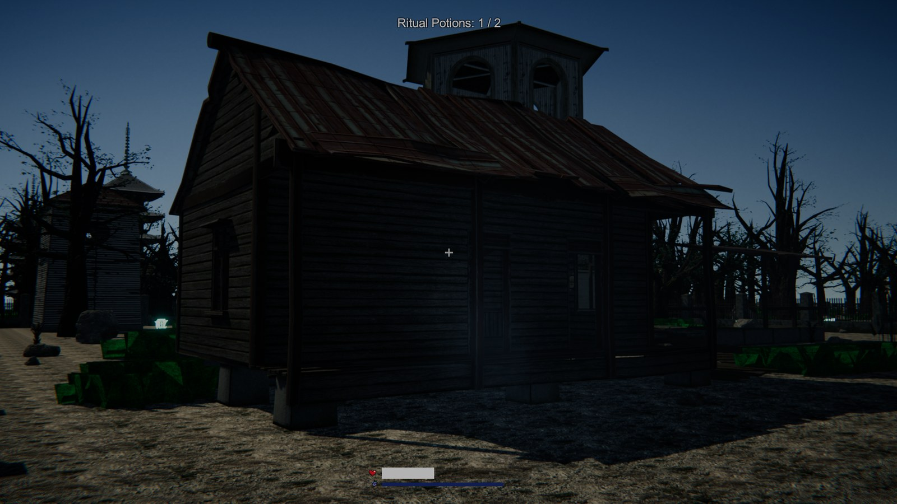
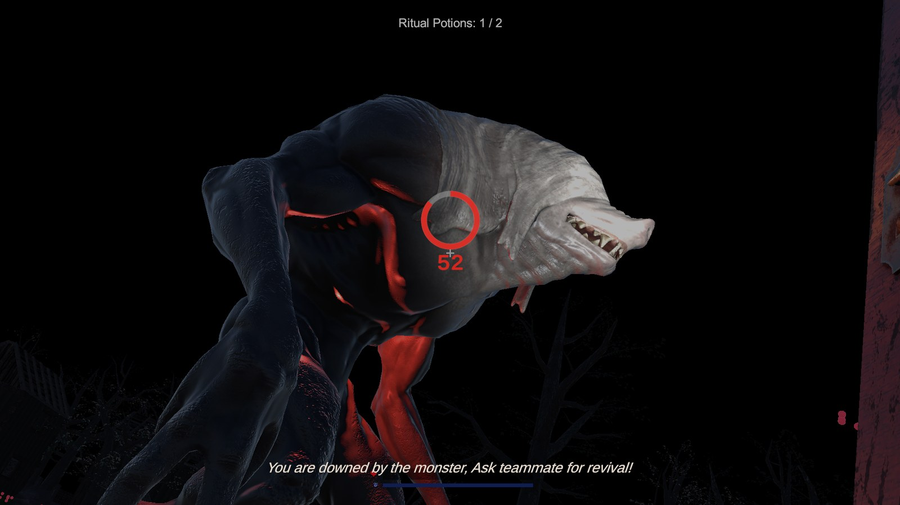

# Sunset Curse

A four-player co-op horror survival game built in Unity 6. A traveller's car breaks down beside a
cursed forest settlement, and the locals reveal he can never leave — unless the group gathers
enough valuables to break the *curse*. Players have **seven in-game days** (shorter 2- and 4-night
runs can be chosen from the menu). Each night the sun sets a little less, and on the last day night
becomes permanent.

**Scale:** 108 C# scripts · ~25,400 lines · single Unity 6 project

> **Role:** Solo developer — coded with Claude Code.

> **This repository contains the game's source code only.** The full Unity project also includes
> licensed Unity Asset Store and Sketchfab art, audio and animation, which are excluded here for
> licensing and size reasons. Every file in `src/` was written for this project using Claude Code.

---

## Screenshots


*Dusk at the haunted parish — the last minutes of daylight before the monsters wake.*


*Caught by the Creep. A downed player bleeds out on a timer unless a teammate reaches them in time.*

---

## Gameplay

- **Day** — forage berries to hold back hunger, gather wood/stone/herbs, craft tools, and plan the night's raid.
- **Night** — the monsters leave their ground. Raid the fortified compound for one hidden Ritual
  Potion per night, and scavenge the parts needed to repair a derelict radio tower.
- **Escape** — two objectives, both required, completable in either order: perform the altar
  **ritual** (a hold-the-line channel that broadcasts noise and draws every monster to you), and
  repair the radio tower to transmit an **SOS** that calls in a rescue helicopter.
- **Pressure** — the safe daylight window shrinks every day (30 seconds less each day); miss the
  deadline and night is permanent.

---

## Tech Stack

| Layer | Technology |
|---|---|
| Engine | Unity **6000.4.8f1** (Unity 6) |
| Language | **C#** (all gameplay, networking, tooling) · ShaderLab/HLSL for water surface work |
| Rendering | Universal Render Pipeline **17.4.0** (Forward+, HDR, TAA, post-processing) |
| Multiplayer | Netcode for GameObjects **2.0.0** + Unity Relay **1.1.0** + Authentication **3.3.0** |
| Input | Unity Input System **1.19.0** (no legacy input) |
| AI / Pathfinding | AI Navigation **2.0.12** (NavMesh, runtime-baked) |
| Camera | Cinemachine **3.1.6** |
| Audio | AudioMixer bus routing (Master ▸ Music / SFX) with PlayerPrefs-backed settings |
| Tooling | Custom Unity Editor extensions (~3,000 lines of editor-only automation) |

---

## Architecture

**Host-authoritative multiplayer.** All shared world state lives on the host and replicates to
peers; clients drive only their own input and movement.

- **Replication primitives** — `NetworkVariable` for shared scalars (day/phase, escape count,
  ritual progress), `NetworkList` for collections that must survive late joins (world drops,
  consumed resource nodes, lobby roster), `ServerRpc` for client requests, and *targeted*
  `ClientRpc` for per-player grants.
- **Deterministic world generation** — the host seeds one replicated world seed; every client
  derives its forest, berry, and daily-pickup scatter from `seed XOR day`. Identical worlds on
  every machine with **zero position traffic**. World objects get deterministic hashed IDs so
  consuming one despawns it team-wide through a single synced integer.
- **Conflict arbitration** — every pickup is server-validated first-grab-wins, so two players
  racing for the same item can never both receive it.
- **Late-join correctness** — new peers replay list-backed state on connect rather than relying
  on one-shot broadcasts.
- **Event-driven time** — a single `GameClock` owns day/night phases and fires C# events;
  ~15 consumer systems subscribe instead of polling in `Update()`.
- **One code path for solo and co-op** — single-player starts a local host (no Relay), so solo
  play runs exactly the same networked code as co-op; systems also keep an offline fallback for
  quick editor testing.

### Backend services
Unity Gaming Services provides anonymous authentication and **Relay**-brokered connectivity —
players host or join with a short code, with no port forwarding or dedicated server. The lobby
(username registration, roster, join announcements, host-gated start) runs on the netcode layer
before the gameplay scene loads.

---

## Features

**Survival** — health/hunger with a lock-on-eat model, night-time starvation damage, health-scaled
movement speed, bandages, downed-and-revive with bleed-out, spectator mode, fall recovery.

**Monster AI** — two distinct hunters. A roaming **stalker** that never has perfect information:
close-range scent, sight (radius + view cone + line-of-sight raycasts), and hearing (sprinting is
loud, walking is quiet, standing still is silent). She drifts toward the nearest player at a walk,
sprints only while she actually senses someone, switches targets between players who stay close
together, and can be stunned, blinded or lured away with crafted items. A territorial **compound
watcher** hunts by sound alone inside its own zone. Plus a jumpscare director and a false-cue
system that plays red-herring growls, so audio can never be fully trusted.

**Crafting & items** — a rebuildable crafting bench with drag-and-drop inventory: torch (blinds and
distracts), lord's potion (disables monsters for 30 seconds), throwable stone distractor, respawn potion, and a river-water bucket used as
a ritual offering.

**World systems** — procedural forest scatter, day/night lighting with shrinking daylight, weather
that muffles noise in *both* directions, a nightly random **omen** system (blood moon, watched safe
house, downpour, restless dead - each having its own features), synced doors, a safe house that monsters cannot enter, and a
procedural river with real current, buoyancy, and Perlin-displaced water.

**Presentation** — animated splash and menu, intro cutscene, difficulty and night-count selection,
a moonlit night with its own colour grade (stained red under the blood-moon omen), ground mist and
dust that only show where light falls, death/victory cinematics, world-space nameplates, proximity
heartbeat/scream stings, and positional footstep audio.

---

## Repository Layout

```
src/
├── Core/      # game clock, shared inventory, escape tracking, omens, difficulty   (9 scripts)
├── Player/    # movement, stats, interaction, climbing, per-player items          (23 scripts)
├── World/     # spawners, crafting, ritual, radio tower, river, doors, weather    (49 scripts)
├── AI/        # stalker, compound watcher, jumpscare director, alert bus           (5 scripts)
├── Net/       # relay bootstrap, lobby, session state, per-player ownership        (6 scripts)
├── UI/        # menus, inventory, HUD, cutscenes                                   (8 scripts)
├── Audio/     # mixer-routed audio manager and settings                            (4 scripts)
└── Editor/    # scene-building, asset-pipeline and play-mode automation            (4 scripts)

media/         # screenshots
```

### Suggested reading order

| File | Why it's worth a look |
|---|---|
| `Core/GameClock.cs` | Server-authoritative time; the event backbone the whole game hangs off |
| `AI/MonsterAI.cs` | The stalker — scent, sight, hearing, target switching, state machine |
| `Core/Inventory.cs` | Shared world state: seeds, synced node consumption, drop registries |
| `Net/NetworkBootstrap.cs` | Relay allocation, authentication, host/join flow |
| `World/RiverFlowController.cs` | Procedural water mesh, Perlin displacement, current volume |
| `Editor/SunsetSceneBuilder.cs` | The editor automation suite |

---

## Credits

The full game additionally uses licensed third-party art, audio and animation (Unity Asset Store
packs, Sketchfab models and Mixamo animations), which are not redistributed in this repository.
